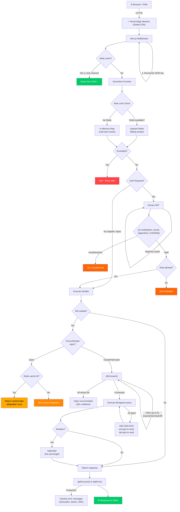
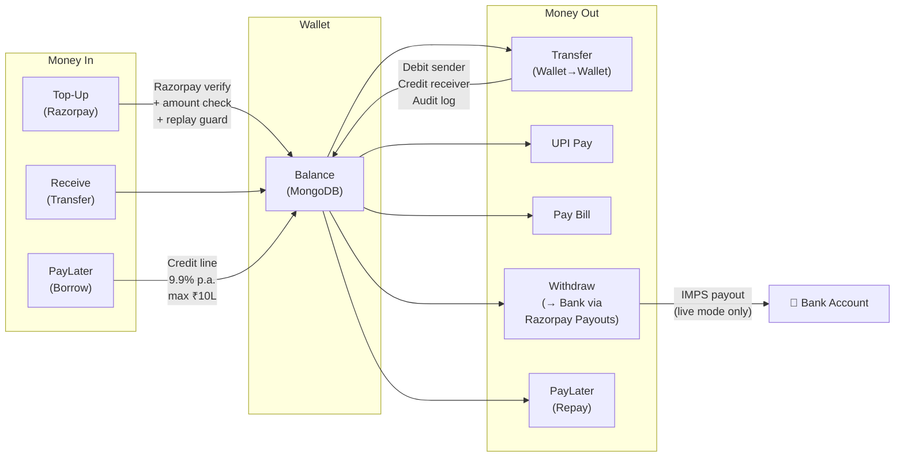
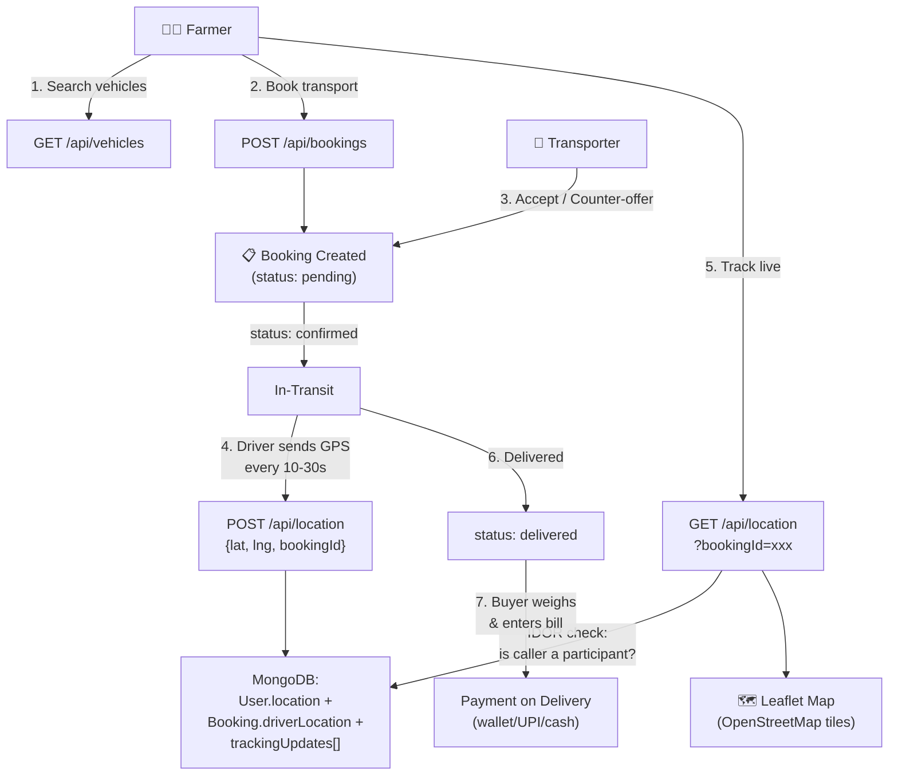
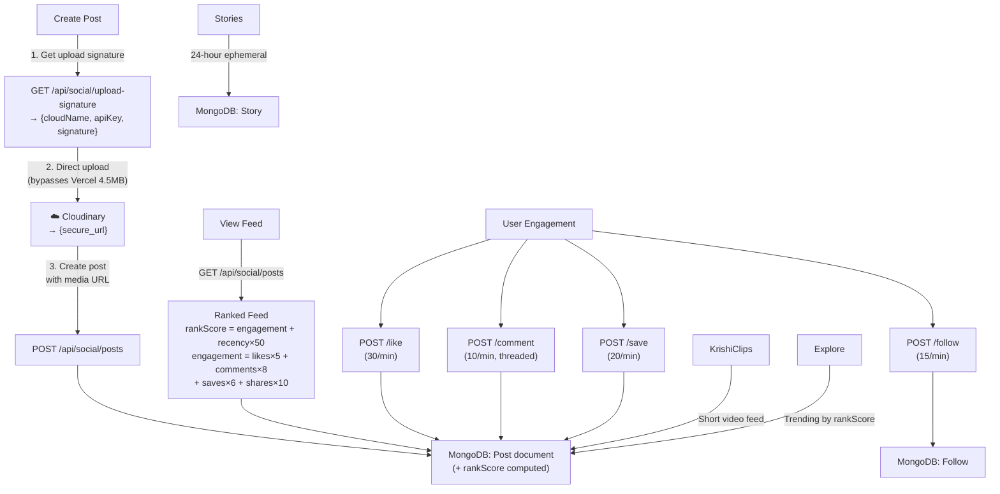
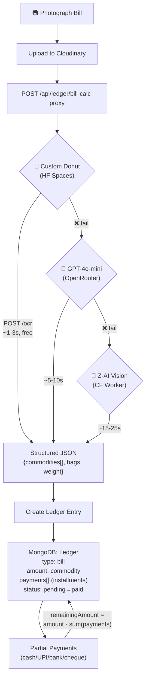
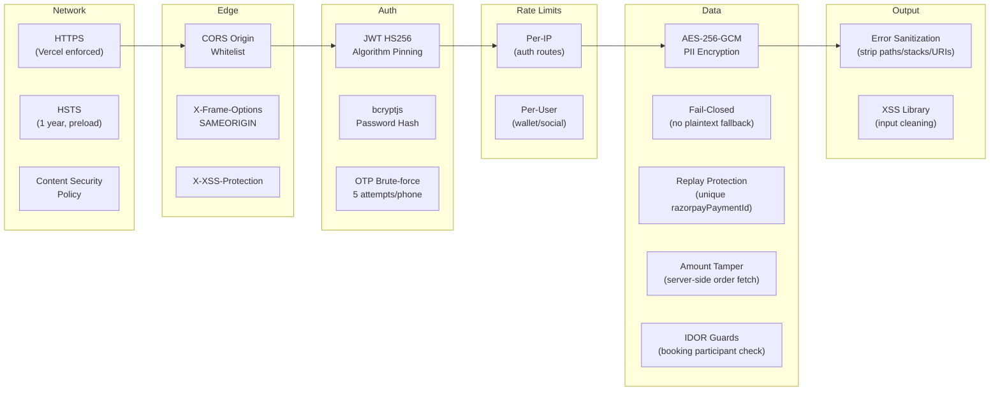

# AgriEasy OS — Combined System Architecture

> One unified view of the entire platform — every layer, every flow, every integration.

---

## Visual Architecture

---

## Master Architecture Diagram

```mermaid
flowchart TB
    %% ════════════════════════════════════════════════════════
    %% CLIENT LAYER
    %% ════════════════════════════════════════════════════════
    subgraph CLIENTS["🌐 Client Layer"]
        direction LR
        WEB["Web App<br/>(Next.js 15 SSR/CSR)"]
        PWA["PWA<br/>(Service Worker)"]
    end

    %% ════════════════════════════════════════════════════════
    %% EDGE LAYER
    %% ════════════════════════════════════════════════════════
    subgraph EDGE["⚡ Edge Layer"]
        direction LR
        MW["Next.js Middleware<br/>━━━━━━━━━━━━━━━━━<br/>✦ HSTS / CSP / X-Frame<br/>✦ CORS (origin whitelist)<br/>✦ X-Request-Id generation<br/>✦ Structured JSON logging"]
        CF["Cloudflare Worker<br/>━━━━━━━━━━━━━━━━━<br/>✦ Bill OCR CORS Proxy<br/>✦ 100K req/day (free)<br/>✦ 30s CPU limit<br/>✦ Works in India"]
    end

    %% ════════════════════════════════════════════════════════
    %% SECURITY PIPELINE
    %% ════════════════════════════════════════════════════════
    subgraph SECURITY["🔒 Security Pipeline (every request)"]
        direction LR
        S1["JWT Verify<br/>(HS256 pinned)"]
        S2["Rate Limiter<br/>(Redis/Memory)"]
        S3["Role Check<br/>(farmer/buyer/<br/>transporter/admin)"]
        S4["Input Validation<br/>(Zod v4 + custom)"]
        S5["XSS Sanitize<br/>(xss library)"]
        S1 --> S2 --> S3 --> S4 --> S5
    end

    %% ════════════════════════════════════════════════════════
    %% APPLICATION LAYER — 7 API DOMAINS
    %% ════════════════════════════════════════════════════════
    subgraph APP["📦 Application Layer — 67+ API Routes (Vercel Serverless)"]
        direction LR
        AUTH["🔐 Auth<br/>━━━━━━━<br/>7 routes<br/>━━━━━━━<br/>register<br/>login<br/>send-otp<br/>verify-otp<br/>logout<br/>session-token<br/>nextauth"]

        PAY["💰 AgriPay<br/>━━━━━━━━<br/>14 routes<br/>━━━━━━━━<br/>wallet<br/>create-order<br/>topup<br/>transfer<br/>transfer-rzp<br/>upi-pay<br/>withdraw<br/>pay-bill<br/>verify-bank<br/>paylater/*<br/>history"]

        SOCIAL["📱 AgriSocial<br/>━━━━━━━━━━<br/>17 routes<br/>━━━━━━━━━━<br/>posts · clips<br/>like · comment<br/>follow · save<br/>explore · search<br/>stories · highlights<br/>collections · DMs<br/>notifications<br/>upload-signature<br/>profile · suggested"]

        MARKET["🛒 Marketplace<br/>━━━━━━━━━━━<br/>4 routes<br/>━━━━━━━━━━━<br/>listings<br/>billing<br/>payment<br/>payment/verify"]

        TRANSPORT["🚛 Transport<br/>━━━━━━━━━━<br/>6+ routes<br/>━━━━━━━━━━<br/>bookings<br/>vehicles<br/>buyer-vehicles<br/>location POST<br/>location GET<br/>farmer/* · buyer/*"]

        LEDGER["📒 Ledger<br/>━━━━━━━<br/>4 routes<br/>━━━━━━━<br/>ledger CRUD<br/>bill-ocr<br/>bill-calc<br/>bill-calc-proxy"]

        ADMIN["👑 Admin<br/>━━━━━━━<br/>8 routes<br/>━━━━━━━<br/>stats<br/>users · users/id<br/>transactions<br/>wallets<br/>posts · posts/id<br/>audit-logs<br/>migrate-encryption"]
    end

    %% ════════════════════════════════════════════════════════
    %% CROSS-CUTTING CONCERNS
    %% ════════════════════════════════════════════════════════
    subgraph CROSS["⚙️ Cross-Cutting Services"]
        direction LR
        ENC["🔑 AES-256-GCM<br/>Encryption<br/>(PII at rest)"]
        AUDIT["📝 Audit Logger<br/>(fire-and-forget)"]
        CACHE["💾 Redis Cache<br/>(TTL + invalidate)"]
        CB["🔌 Circuit Breaker<br/>(5 fails → 30s open)"]
        GD["🛡️ Graceful<br/>Degradation<br/>(serve cached)"]
        FF["🚩 Feature Flags<br/>(12 flags,<br/>localStorage)"]
    end

    %% ════════════════════════════════════════════════════════
    %% DATA LAYER
    %% ════════════════════════════════════════════════════════
    subgraph DATA["🗄️ Data Layer"]
        direction LR
        MONGO["MongoDB Atlas (Mongoose 9)<br/>━━━━━━━━━━━━━━━━━━━━━━━━━━━━<br/>19 Models:<br/>User · Wallet · Transaction · PayLater<br/>Post · Follow · Story · Highlight · Collection<br/>Listing · Booking · Vehicle · BuyerVehicle<br/>Ledger · Billing · Conversation · Notification<br/>Metric · AuditLog<br/>━━━━━━━━━━━━━━━━━━━━━━━━━━━━<br/>Pool: 10-50 · Retry: 5x backoff · Heartbeat: 10s"]

        REDIS["Upstash Redis (REST)<br/>━━━━━━━━━━━━━━━━<br/>✦ OTP Store (5 min TTL)<br/>✦ Rate Limit Counters<br/>✦ Cache (5 min default)<br/>✦ Brute-force Counters"]
    end

    %% ════════════════════════════════════════════════════════
    %% EXTERNAL SERVICES
    %% ════════════════════════════════════════════════════════
    subgraph EXTERNAL["🌍 External Services"]
        direction LR
        RZP["Razorpay<br/>━━━━━━━━━<br/>✦ Create Order<br/>✦ Verify Signature<br/>✦ Fetch Order (anti-tamper)<br/>✦ Fund Accounts<br/>✦ Payouts (IMPS)"]

        CLD["Cloudinary<br/>━━━━━━━━━<br/>✦ Signed Upload<br/>✦ Direct from client<br/>✦ Bypasses 4.5MB limit<br/>✦ Image/Video hosting"]

        SMS_SVC["SMS Gateway<br/>━━━━━━━━━━━<br/>✦ Twilio (global)<br/>✦ Fast2SMS (India)<br/>✦ Pluggable provider<br/>✦ Console fallback (dev)"]

        EMAIL["SMTP Email<br/>━━━━━━━━━━<br/>✦ Nodemailer<br/>✦ Gmail SMTP<br/>✦ Admin alerts<br/>✦ Optional (no-op)"]

        OSM["OpenStreetMap<br/>━━━━━━━━━━━━<br/>✦ Nominatim geocoding<br/>✦ Tile server (maps)<br/>✦ Leaflet + React-Leaflet"]
    end

    %% ════════════════════════════════════════════════════════
    %% ML PIPELINE
    %% ════════════════════════════════════════════════════════
    subgraph ML["🤖 ML Pipeline — Bill OCR"]
        direction TB
        subgraph TRAIN["Training (Offline)"]
            direction LR
            T1["100K Bill Images"]
            T2["GPT-4o-mini<br/>Auto-Label"]
            T3["Donut Fine-tune<br/>(Colab T4 GPU)"]
            T4["HuggingFace Model<br/>rishabh01487/<br/>agrieasy-bill-ocr"]
            T1 --> T2 --> T3 --> T4
        end
        subgraph INFER["Inference (Live — 3-tier fallback)"]
            direction LR
            I0["📷 Bill Photo"]
            I1["🥇 Donut Model<br/>(HF Spaces)<br/>~95% · 1-3s · Free"]
            I2["🥈 GPT-4o-mini<br/>(OpenRouter)<br/>~85% · 5-10s · ₹0.000003"]
            I3["🥉 Z-AI Vision<br/>(CF Worker)<br/>~80% · 15-25s · Free"]
            I4["Structured JSON<br/>{commodities, bags,<br/>weight, total}"]
            I0 --> I1
            I1 -->|fail| I2
            I2 -->|fail| I3
            I1 -->|success| I4
            I2 -->|success| I4
            I3 --> I4
        end
    end

    %% ════════════════════════════════════════════════════════
    %% DEPLOYMENT
    %% ════════════════════════════════════════════════════════
    subgraph DEPLOY["🚀 Deployment (3 Providers)"]
        direction LR
        D1["Vercel<br/>━━━━━━━<br/>Primary App<br/>Serverless Functions<br/>Edge CDN<br/>Auto-deploy (Git)"]
        D2["Cloudflare Workers<br/>━━━━━━━━━━━━━━━<br/>OCR CORS Proxy<br/>100K req/day free<br/>30s CPU limit<br/>Auto-deploy (Git)"]
        D3["HF Spaces<br/>━━━━━━━━<br/>Donut OCR Model<br/>Docker (FastAPI)<br/>Free CPU tier<br/>Port 7860"]
    end

    %% ════════════════════════════════════════════════════════
    %% CONNECTIONS
    %% ════════════════════════════════════════════════════════
    CLIENTS --> EDGE
    MW --> SECURITY
    SECURITY --> APP
    APP --> CROSS
    APP --> DATA
    CROSS --> DATA

    AUTH --> SMS_SVC
    PAY --> RZP
    SOCIAL --> CLD
    MARKET --> RZP
    TRANSPORT --> OSM
    LEDGER --> ML

    CF --> ML

    ENC --> MONGO
    AUDIT --> MONGO
    CACHE --> REDIS
    CB --> MONGO
    S2 --> REDIS

    APP --> D1
    CF --> D2
    ML --> D3
```

---

## Unified Request Lifecycle

Every single API request follows this exact path through the system:

---

## Data Flow by Domain

### 💰 AgriPay — Complete Money Flow

### 🚛 Transport — Booking & Tracking Flow

### 📱 AgriSocial — Content & Engagement Flow

### 📒 Ledger — Bill OCR & Financial Records

---

## Security at Every Layer

---

## Deployment & Infrastructure Summary

| Provider | Service | What Runs | Cost | Auto-Deploy |
|----------|---------|-----------|------|-------------|
| **Vercel** | Serverless Functions + CDN | Next.js 15 app (all 67+ API routes + SSR pages) | Hobby (free) / Pro | ✅ Git push |
| **Cloudflare Workers** | Edge compute | Bill OCR CORS proxy (`worker.js`) | Free (100K/day) | ✅ Git push via Workers Builds |
| **HF Spaces** | Docker container | Donut OCR inference API (FastAPI, port 7860) | Free CPU | Manual upload |
| **MongoDB Atlas** | Managed DB | 19 Mongoose models, connection pooling (10-50) | M0 Free | — |
| **Upstash Redis** | Serverless Redis (REST) | OTP store, rate limits, cache | Free tier | — |
| **Razorpay** | Payment gateway | Orders, signature verify, fund accounts, payouts | Per-transaction | — |
| **Cloudinary** | Media CDN | Image/video hosting, signed direct upload | Free tier | — |
| **Twilio / Fast2SMS** | SMS | OTP delivery (pluggable) | Per-SMS | — |

---

## Numbers at a Glance

| Metric | Count |
|--------|-------|
| **API Routes** | 67+ |
| **API Domains** | 7 (Auth, AgriPay, Social, Marketplace, Transport, Ledger, Admin) |
| **Database Models** | 19 |
| **User Roles** | 4 (Farmer, Buyer, Transporter, Driver) |
| **Rate-Limited Endpoints** | 30 |
| **Feature Flags** | 12 |
| **Encrypted PII Fields** | 6 (Aadhaar, DL, bankName, bankHolder, accountNumber, UPI) |
| **External Services** | 8 (Razorpay, Cloudinary, Twilio, Fast2SMS, SMTP, OpenStreetMap, OpenRouter, Z-AI) |
| **Deployment Providers** | 3 (Vercel, Cloudflare, HF Spaces) |
| **Security Layers** | 16 |
| **Indian Validators** | 7 (Aadhaar/Verhoeff, DL, UPI, GSTIN, PAN, Phone, PIN) |
| **ML Fallback Tiers** | 3 (Donut → GPT-4o → Z-AI) |
